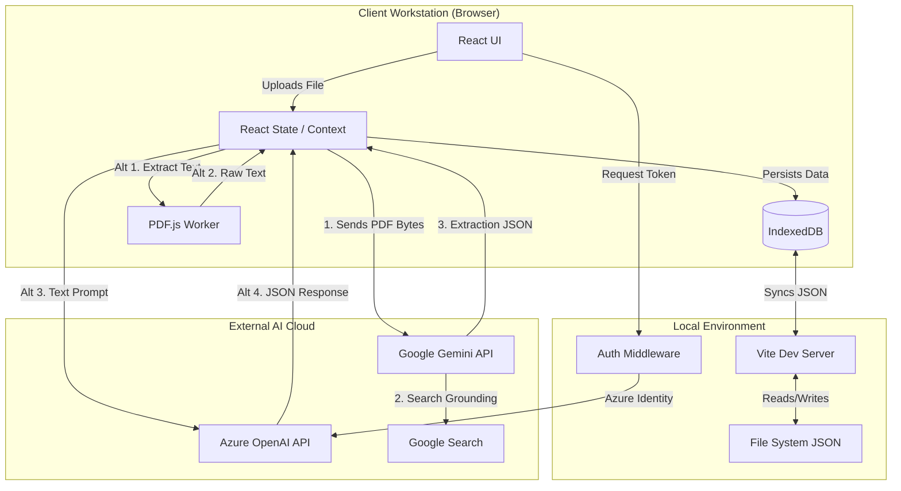
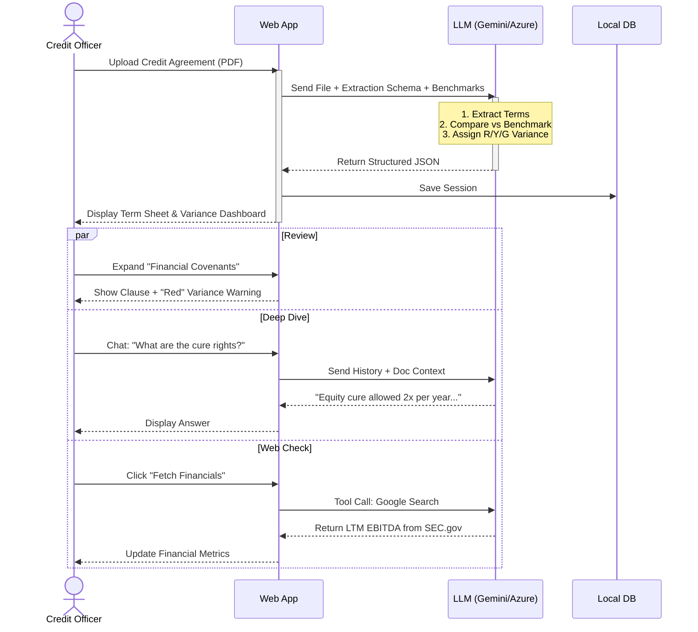

# CreditInsight Architecture Documentation

## 1. Business Overview

**CreditInsight** is an AI-powered automated analysis tool designed for Corporate Banking Credit Officers and Portfolio Managers. It addresses the labor-intensive process of reviewing complex credit agreements (often 100+ pages) by using Large Language Models (LLMs) to extract key financial terms, covenants, and definitions.

### Key Value Propositions
*   **Efficiency**: Reduces initial document review time from hours to minutes.
*   **Standardization**: Automatically compares extracted terms against a defined "Market Benchmark" (e.g., standard leverage ratios, cure periods) to identify deviations (Risk Variance).
*   **Risk Mitigation**: Highlights aggressive terms (e.g., "J.Crew" or "Chewy" blockers, infinite leakage baskets) via color-coded variance analysis.
*   **Portfolio Intelligence**: The Matrix View allows side-by-side comparison of multiple borrowers to identify portfolio-wide exposure to specific legal provisions.

---

## 2. Technology Stack

The application is built as a **Local-First Single Page Application (SPA)** that leverages modern browser capabilities and GenAI APIs.

### Frontend
*   **Framework**: [React 19](https://react.dev/) with [TypeScript](https://www.typescriptlang.org/) for type safety.
*   **Build Tool**: [Vite](https://vitejs.dev/) for fast development and bundling.
*   **Styling**: [Tailwind CSS](https://tailwindcss.com/) for utility-first styling.
*   **UI Components**: [Lucide React](https://lucide.dev/) for iconography.
*   **PDF Processing**: `pdfjs-dist` (Client-side) for converting PDFs to text when using Azure OpenAI (which does not accept raw PDF bytes).

### AI & Intelligence Layer
The app supports a dual-provider strategy to ensure redundancy and compliance:
1.  **Google Gemini API (Primary)**:
    *   **Model**: `gemini-3-flash-preview` (Low latency, high reasoning).
    *   **Features Used**: Native Document Processing (MIME type support), 1M+ Token Context Window, JSON Mode, Function Calling (Google Search Grounding).
2.  **Azure OpenAI (Enterprise/Secondary)**:
    *   **Model**: GPT-4o / GPT-4 Turbo.
    *   **Mechanism**: Requires client-side text extraction (PDF.js) before sending prompts.

### Data Persistence
*   **Primary Store**: `IndexedDB` (Browser) for storing deal sessions, chat history, and large file blobs.
*   **Synchronization**: Custom Vite Middleware acts as a lightweight local server to sync IndexedDB state to a local JSON file (`credit_insight_db.json`), enabling data persistence across server restarts during development.

---

## 3. Architecture Diagram

The following diagram illustrates the high-level data flow between the Client, Local Server, and External AI Services.

---

## 4. Business User Flow Diagram

This diagram maps the user journey from document ingestion to actionable risk analysis.

---

## 5. Future Target State Enhancements

To move this application from a standalone tool to an enterprise platform, the following architectural evolutions are recommended:

### A. Backend Implementation
*   **Current**: Local JSON/IndexedDB.
*   **Target**: Python (FastAPI) or Node.js (NestJS) backend with PostgreSQL.
*   **Reasoning**: Enables centralized portfolio management, user collaboration, and RBAC (Role-Based Access Control).

### B. Vector Search (RAG)
*   **Current**: Relies on Long Context Windows (sending full document every time).
*   **Target**: Implement a Vector Database (e.g., Pinecone, Milvus, pgvector).
*   **Reasoning**: Allows querying across the *entire* portfolio (e.g., "Show me all deals with EBITDA add-backs > 20%"). Reduces token costs for chat interactions.

### C. Security & Authentication
*   **Current**: Environment variables / Local Azure Identity.
*   **Target**: OIDC/SAML integration with Active Directory.
*   **Reasoning**: Strict banking compliance requirements for data access.

### D. Downstream Integration
*   **Current**: CSV Export.
*   **Target**: API connectors to Loan IQ or internal credit spreading tools.
*   **Reasoning**: Eliminates double-entry of data into core banking systems.

### E. Advanced Document Parsing
*   **Current**: Standard PDF text extraction.
*   **Target**: OCR + Layout Analysis (e.g., Azure Document Intelligence).
*   **Reasoning**: Better handling of scanned PDFs and complex tables within credit agreements.
